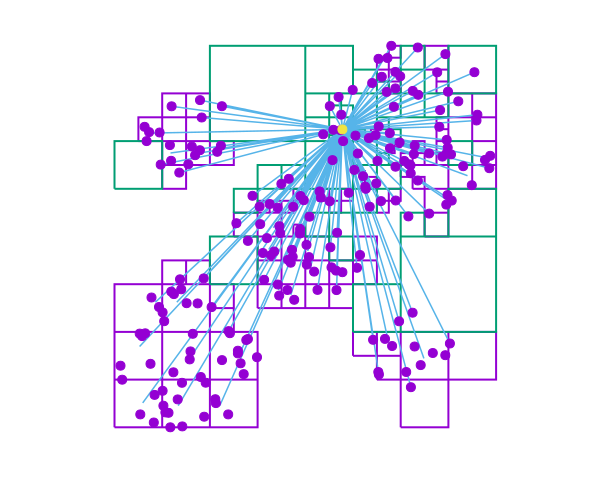

# Introduction

The Barnes–Hut algorithm following [BarnesHut]

# Install

    (cd lib && make)
    (cd example && make)

# References

- Barnes, J., & Hut, P. (1986). A hierarchical O (N log N)
  force-calculation algorithm. nature, 324(6096), 446-449.
